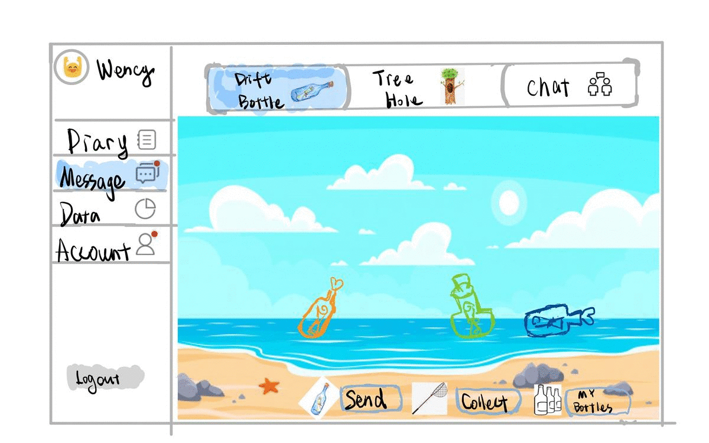
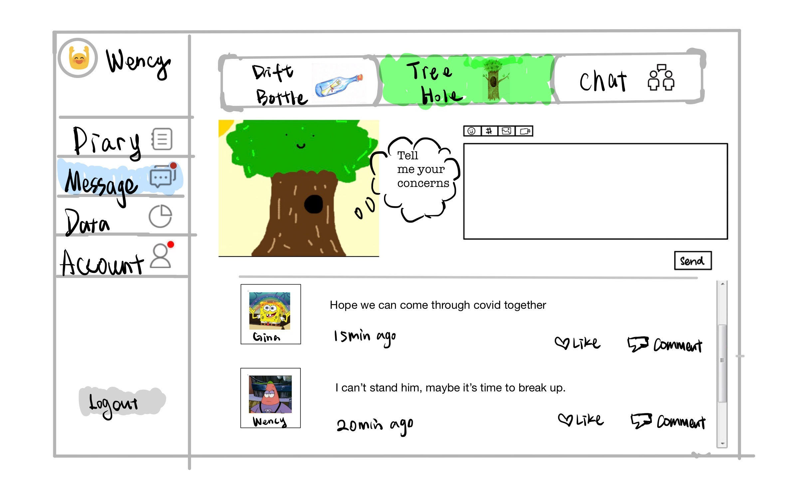

### High-level Description:

'Connect the Dots' is an anonymous social web application that allow anonymous users to pour out those annoying issues (secrets, stress, trouble or persistence,etc) without any concerns and pass their love and warmth to others. After registering for an account and login, an user can create diaries entries that contain texts, videos, audios, pictures and store them in a safe place for later access and management. Data on the user's diaries entries are also calculated and showcased in the forms of beautiful pie charts. The user can also write anonymous messages and send them out to the world and receive back replies from other users as well as having instant text-based chat with a random stranger.

### Project Description: 
*Who is it for?*

The Application is intended for everyone, especially people with the needs for human communication and understanding, social interactions, self-expression, and sharing of thoughts. 

*What will it do? (What "human activity" will it support?)*

‘Connect the Dots’ will allow anonymous users to pour out those annoying issues (secrets, stress, trouble or persistence,etc) without any concerns and pass their love and warmth to others.

We are all one small dot in this vast universe, independent but could also be connected. Our application aims to gather those original anonymous ‘dots’ who seek for a tree hole or companionship and let them build up their own connections; know themselves better and in order to fully accept themselves through the pouring out; finally healing each other during the connections. Users can not only record their diary through text, image, audio and video here but also can form the communication with random strangers through the virtual message in the bottle or the tree hole posts which refers to the anonymous blogs, or instant messaging.

*What type of data will it store?*

We will store a lot of diary entries in the forms of texts, pictures, and videos. Users' information like name, date of birth, password, profile picture, and description will also be encrypted and stored. Additionally, we will also store chat logs and messages in the forms of texts, pictures, and videos. 

*What will users be able to do with this data?*

The users can see all data related to their accounts by accessing the Application’s graphical user interface.

*What is some additional functionality you can add/remove based on time constraints?*

We are aiming to allow users to play mini games as well as having video/audio calls with each other. Based on time constraints, we will either include or exclude it from the final deliverable.

### Project task requirements: 

*Minimal requirements (will definitely complete)*

1. Allow users to create accounts.
2. Allow users to modify their accounts (profile pictures, description, etc.)
3. Allow users to write and store diary entries in the form of pictures, text, videos, etc.
4. Allow users to send messages, pictures, videos to random strangers and get their responses.
5. Allow users to send messages, pictures, videos into a public space where all users can see and respond.

*Standard requirements (will most likely complete)*

1. Allow users to search for the diary entry by dates, key words and weather, emotion, activite tags that they added to their diaries.
2. Allow users to view the diary-related data, which includes the user emotion report and the charts that will reflect users' emotional change.(For example, showcase the most frequent emotion user pick for their diary entry and their emotion distribution in a month.)
3. Allow users to favorite their preferred diaries.
4. Allow users to edit their diary entries.
5. Allow users to delete their diary entries.

*Stretch requirements (plan to complete at least 1!)*
1. Allow users to add friends through search or 'add' button beside user name.;
2. Allow users to connect via video and/or audio call to a random stranger.
3. Allow users to connect to a random stranger and have a text-based chat.

### Minimal requirements task breakdown:
1. Allow users to create accounts.
	- Create a user class and its constructor (what fields should a user have? Unique id; nickname; password, etc)
	- Create a table/list to store the user instances
	- Create functions to add/delete users
2. Allow users to modify their accounts (profile pictures, description, etc.)
	- Create a blog page (webpage) for each user
	- Create a function to insert pictures and store them in the database
3. Allow users to write and store diary entries in the form of pictures, text, videos, etc.
	- Create a diary entry class and its constructor
	- Create a table/list to store the entry instances
	- Create a function to sort the entry based on timestamps (or create a priority list for entry instances)
	- Create a function to delete/modify the diary entries
4. Allow users to send messages, pictures, videos (anonymously or non-anonymously) to random strangers and get their responses.
	- Create a channel (intermedia) to enable user-to-user communication
	- Create a function to find a random user in the user list and return the unique id (if has one)
	- Create a function to insert pictures and store into database
	- Create a function to input messages and store into database
	- Create a function to insert videos and store into database

Sketches:

Allow users to write and edit and store diary entries in the form of pictures, text, videos, etc.

Drift bottle: Allow users to send messages, pictures, videos (anonymously or non-anonymously) to random strangers and get their responses.

Tree hole post: Allow users to send messages, pictures, videos (anonymously or non-anonymously) into a public space where all users can see and respond.

